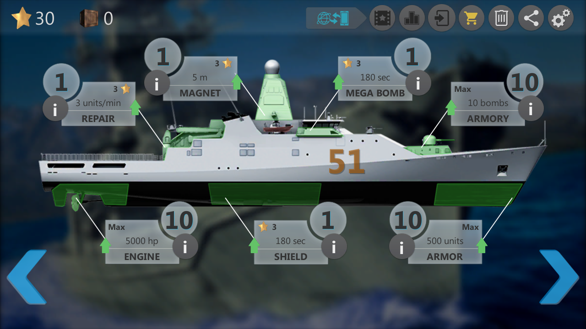
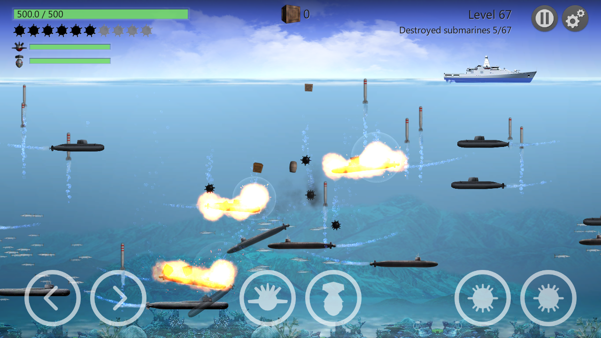
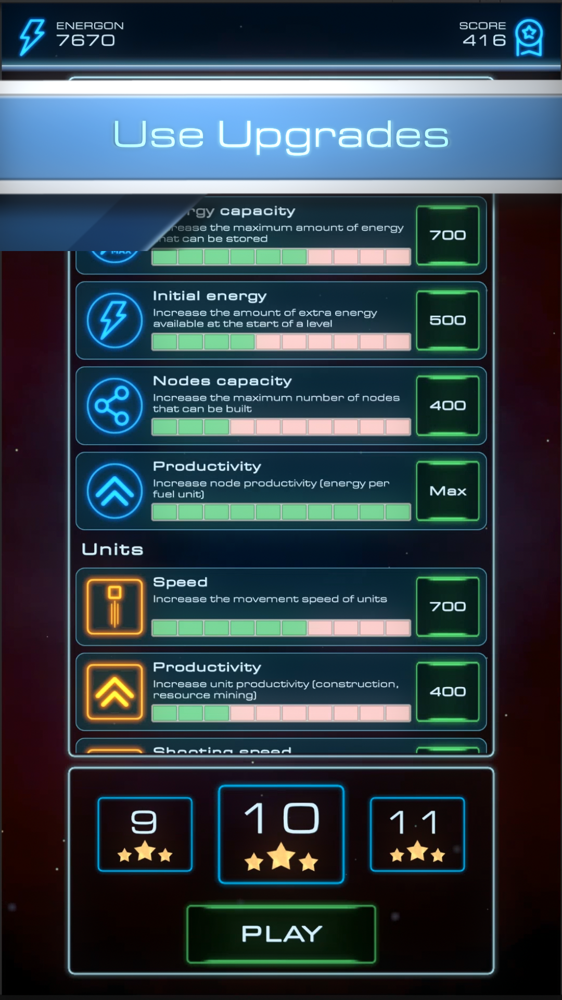
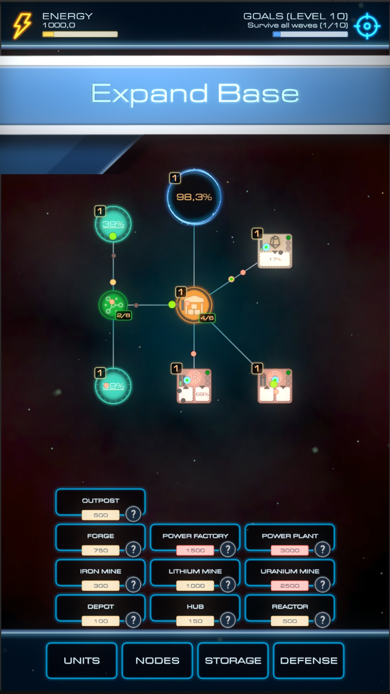

## 🎮 Our Games

---

### 🚢 Sea Battle: Submarine Warfare

Sea Battle: Submarine Warfare is an exciting shooting game in the underwater world. 
You are the brave and clever captain of the ship. Your goal is to smash all the submarines that are shooting at your cruiser, stay alive at Sea Battle, and become a war thunder.

#### Features
- 10 languages
- 2 game modes: campaign and survival
- Upgrade of the ship by 7 parameters
- 4 types of extra weapons
- Matching game and real-time of day (graphic display)
- 2 modes of changing the "time of day" (random and synchronous)
- 2 control modes: buttons and accelerometer
- An endless number of levels

#### Screenshots

---

### 🚀 Starfall: Defense Grid

A space strategy game with tower defense elements, where you build and expand a base made of platforms, manage units, and defend against waves of enemies.

#### Features
- More than 10 types of upgrades
- More than 10 types of nodes (platforms)
- 4 types of units
- 3 types of enemies

#### Screenshots

